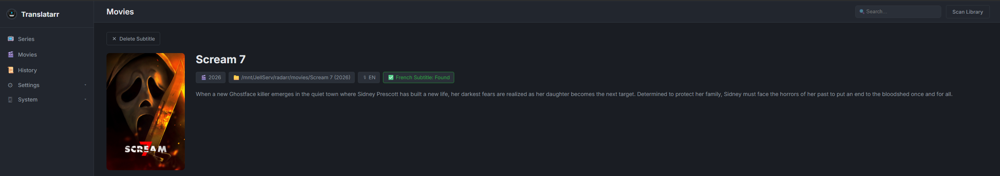
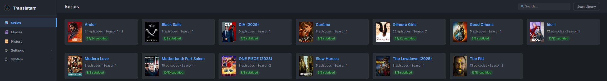
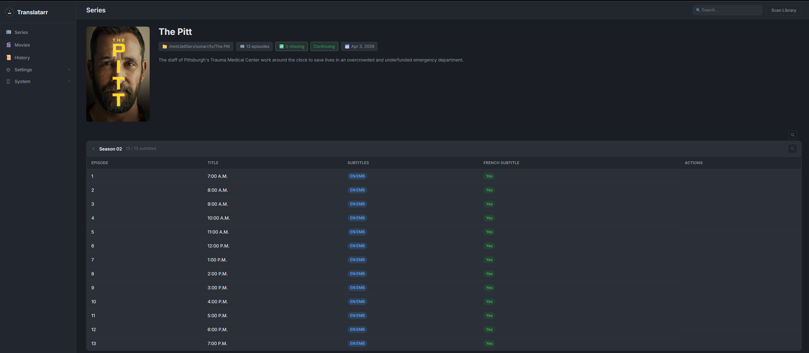

# Translatarr

> Automatic subtitle generation for your media library — transcription via **faster-whisper** (OpenAI Whisper models, INT8 optimised), translation via **Google Translate**, no API key required.

Translatarr is a self-hosted web application built to solve a common frustration: watching media on **Jellyfin** on your TV and ending up with subtitles that are out of sync, in the wrong language, or simply missing. Tools like **Bazarr** download subtitles from online sources, but when nothing is available or what's available doesn't match your encode, you're stuck. Translatarr fills that gap by generating subtitles directly from the audio using Whisper, translating them with Google Translate and validating their timing.

It can work **alongside Bazarr** (as a fallback when Bazarr finds nothing) or **replace it entirely** if you prefer generating subtitles locally. Generated `.srt` files are written directly alongside your media files and picked up automatically by Jellyfin and Plex.

---

# Status

[](https://github.com/aleknomu/translatarr/stargazers)
[](https://github.com/aleknomu/translatarr/issues)
[](https://github.com/aleknomu/translatarr/actions/workflows/ci.yml)
[](https://hub.docker.com/r/aleknomu/translatarr)
[](LICENSE)

---

# Support

- Report bugs and request features on [GitHub Issues](https://github.com/aleknomu/translatarr/issues)

---

## Major Features Include

- **Smart pipeline**: detects existing English and target-language subtitles and picks the best strategy automatically: resync, translate, or transcribe from audio
- **Auto-resync**: if a translated `.srt` and a source `.srt` both exist with matching entry counts, Translatarr realigns the translated timestamps without re-translating anything
- **Automatic translation** via `deep-translator` (free Google Translate, no API key required)
- **Smart subtitle handling**: multi-line entries joined before translation, dialogue lines (`- Speaker`) translated independently and reassembled, HTML tags (`<i>`, `<font>`) preserved, SDH annotations (`[music]`, `(laughing)`, `♪…♪`) skipped
- **Whisper transcription**: when no source subtitle exists, extracts audio with ffmpeg and transcribes with Whisper (auto language detection)
- **Sync validator**: detects overlaps, negative durations, empty entries, and out-of-bounds subtitles after generation
- **Configurable**: choose Whisper model size, source language, target language, sync check on/off
- **Web UI**: manage movies and TV series, trigger generation per episode / season / series, view history and live logs
- **Task queue**: subtitle generation runs in the background with progress tracking and cancellation support
- **Scheduled scans**: periodic library scan to pick up newly added media automatically
- **Delete subtitles**: remove a generated subtitle at any level (episode, season, full series, movie) and reset the database entry

---

## Supported Languages

The following target languages are available in the Settings UI:

| Code | Language |
|------|----------|
| `fr` | French |
| `es` | Spanish |
| `de` | German |
| `it` | Italian |
| `pt` | Portuguese |

---

## Screenshot



---

## Getting Started

### Docker Run

```bash
docker run -d \
  --name translatarr \
  -e PUID=1000 \
  -e PGID=1000 \
  -e TZ=Europe/Paris \
  -p 6868:6868 \
  -v /path/to/translatarr/config:/config \
  -v /path/to/movies:/movies \
  -v /path/to/tv:/tv \
  --restart unless-stopped \
  aleknomu/translatarr:latest
```

The web interface is then available at `http://your-server-ip:6868`.

---

### Docker Compose

```yaml
services:
  translatarr:
    image: aleknomu/translatarr:latest
    container_name: translatarr
    environment:
      - PUID=1000
      - PGID=1000
      - TZ=Europe/Paris
    volumes:
      - /path/to/translatarr/config:/config
      - /path/to/movies:/movies
      - /path/to/tv:/tv
    ports:
      - 6868:6868
    restart: unless-stopped
```

### Manual installation

```bash
uv sync
uv run translatarr
```

Options:

```bash
translatarr --port 6868 --host 0.0.0.0 --config-dir /data/config
```

---

## Configuration

After starting, open the web UI and go to **Settings → General**:

| Setting | Description | Default |
|---|---|---|
| Movies path | Directory containing your movie `.mkv` files | `/movies` |
| Series path | Directory containing your TV series `.mkv` files | `/tv` |
| Target language | Subtitle output language (ISO 639-1 code) | `fr` |
| Whisper model | Transcription model size (see table below) | `medium` |
| Source language | Force audio language, skip auto-detection | auto |
| Sync check | Validate subtitle timing after generation | enabled |
| Generate after scan | Automatically queue subtitle generation for all media without subtitles after each scan | disabled |

### Whisper model comparison

Translatarr uses [faster-whisper](https://github.com/SYSTRAN/faster-whisper) with INT8 quantization, which is 2–4× faster than the original OpenAI Whisper and uses roughly half the VRAM.

| Model | Speed | Accuracy | VRAM | CPU (1h video) |
|----------|------------|----------|-------|--------|
| `tiny`   | ⚡⚡⚡⚡ | ★☆☆☆☆ | ~0.4 GB | ~2 min  |
| `base`   | ⚡⚡⚡    | ★★☆☆☆ | ~0.5 GB | ~5 min |
| `small`  | ⚡⚡      | ★★★☆☆ | ~1 GB | ~15 min |
| `medium` | ⚡        | ★★★★☆ | ~2.5 GB | ~45 min |
| `large`  | 🐢        | ★★★★★ | ~5 GB | ~2 h |

`medium` is the recommended default. Use `large` for professional results on noisy or multi-speaker content.

---

## How it works

When Translatarr processes an MKV file, it follows this priority order:

1. **Looks for existing target-language `.srt`** (e.g. `.fr.srt`, `.fre.srt`, `.french.srt`)
2. **Looks for existing source-language `.srt`** (e.g. `.en.srt`, `.eng.srt`, `.srt`) or embedded subtitle track in the MKV
3. **Both exist, same entry count, already aligned** → skip (nothing to do)
4. **Both exist, same entry count, different timestamps** → resync: apply source timestamps to translated text (no translation)
5. **Both exist but different entry counts** → translate source to target language
6. **Only source exists** → translate to target language, preserve all timings
7. **Neither exists** → extract audio with ffmpeg → transcribe with Whisper → translate to target language

---

## FAQ

**When is Whisper AI used?**
> In practice, less than 5% of the time. Most media already includes an embedded English subtitle track that simply needs to be translated.

**How long does it take to translate a 10-episode season?**
> Around 5 minutes.

---

## License

MIT — see [LICENSE](LICENSE) for details.
